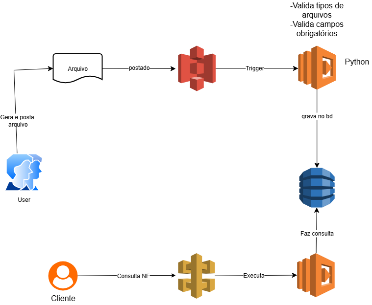
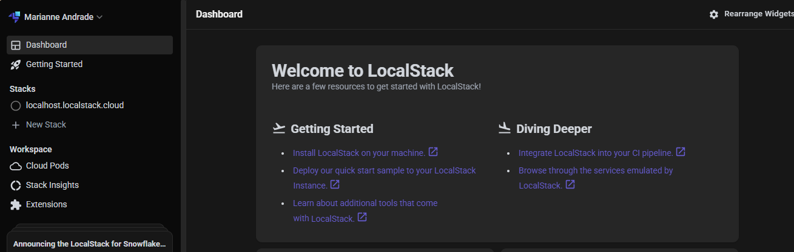
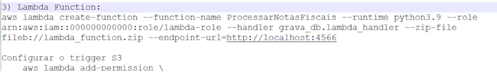

# Executando-Tarefas-Automatizadas-com-Lambda-Function-e-S3

## 🚀 Automatização com Amazon S3 e Lambda 

A integração entre o Amazon S3 (Simple Storage Service) e o AWS Lambda permite criar fluxos de trabalho automatizados e sem servidor (serverless). A ideia central é simples: quando um evento acontece no S3 — como o upload de um arquivo — ele pode acionar automaticamente uma função Lambda para executar uma tarefa específica, sem necessidade de servidores dedicados.

### 🔧 Como funciona na prática:

Um arquivo é enviado para um bucket do S3.

Esse evento dispara uma função Lambda.

A função pode processar o arquivo, extrair dados, converter formatos, registrar informações no DynamoDB, enviar notificações, entre outros.

### 💡 Vantagens:

Totalmente gerenciado e escalável.

Redução de custos com infraestrutura.

Ideal para pipelines de dados, automação de uploads, e processamento sob demanda.

## 🧠 Amazon S3

- É um serviço de armazenamento em nuvem da AWS que permite"armazenar e acessar" dados de forma segura e escalável. Ele suporta qualquer tipo de arquivo (vídeo, áudio, documentos,etc.) e é ideal para backup e armazenamento de objetos.
  
  ### 💡 Princincipais vantagens do S3:
  
  -*Durabilidade:* Altamente confiável, com redundância para proteger contra falhas.
  
  -*Disponibilidade:* Garante acesso contínuo aos dados.
  
  -*Escalabilidade:* Ajusta automaticamente a capacidade de armazenamento conforme a necessidade.
  
  -*Segurança:* Oferece criptografia, controle de acesso e monitoramento de atividades.

  ## 🧠 AWS Lambda
  
  - É um serviço de computação em serveless que permite executar código em resposta a eventos, sem a necessidade de gerenciar servidores. Basta fazer o upload do código e o Lambda se encarrega de executar automaticamente, escalando conforme a demanda.

    ### 💡 Princincipais vantagens do Lambda:
    
    -*Execução sob demanda:* O código é executado apenas quando necessário, respondendo a eventos.
    
    -*Escalabilidade automática:* Ajusta a capacidade automaticamente com base no número de eventos.
    
    -*Custo Eficiente:* Cobra apenas pelo tempo de execução e pela quantidade de solicitações.
    
    -*Integração com outros serviços AWS:* Funciona como um conector entre diversos serviços da AWS, como S3, DynamoDB, API Gateway.

    ## ⚙️ HandsOn:

     
    
 ###  1. Usuário gera e envia arquivo

O usuário cria um arquivo (ex: planilha, JSON, etc.) e o envia para um bucket do Amazon S3.

  ### 2. Arquivo é armazenado no S3

O S3 recebe o arquivo e registra o evento de upload.

  ### 3. Evento no S3 aciona uma função Lambda

O upload dispara automaticamente uma função Lambda via trigger configurado no bucket.

  ### 4. Processamento inicial com Python

A função Lambda executa um script Python que realiza:

Validação de tipo de arquivo (ex: só aceita .csv ou .json)

Verificação de campos obrigatórios (ex: nome, data, valor)

  ###  5. Gravação dos dados no DynamoDB

Após validação, os dados extraídos do arquivo são armazenados em uma tabela do DynamoDB.

  ###  6. Consulta à base de dados

O DynamoDB é consultado para verificar ou recuperar dados específicos.

  ### 7. Nova função Lambda é acionada

A consulta ao banco ativa outra função Lambda que processa ou retorna os dados solicitados.

  ### 8. Resposta ao cliente

O resultado da consulta é enviado ao cliente, que pode visualizar ou utilizar os dados.

  ### 9. Cliente realiza nova consulta (ex: Nota Fiscal)

O cliente pode fazer uma nova requisição, como buscar informações de nota fiscal, que novamente aciona a Lambda.

## AWS Local com LocaStack:

Projeto OpenSource, que nos ajuda a simular localmente a AWS.

Criado em 2016 pela Atlantis Software, somente em 2017 o projeto se tonrou publico.

A Localstack oferece uma versão open-source, gratuita e com suporte a vários serviços.

Também possui uma versão Pro e Enterprise, que oferece recursos avançados, como suporte a endopoints de rede personalizados.

O pricipal objetivo da Localstack é fornecer uma alternativa local para p desenvolvimento, teste e integração de serviços em nuvem, sem necessidade de acessar a AWS real.

Isso permite aos desenvolvedores economizar tempo e custos, especialmente em testes automátizados e em ambientes de integração continua (CI/CD).

Serviços suportados: Lambda, API Gateway, S3, DynamoDB, SNS, SQS, CloudFormation, entre outros.

## 🚀 Criando Recursos com LocalStack

Ao desenvolver aplicações que utilizam serviços da AWS, é essencial contar com um ambiente de testes confiável e acessível. É aí que entra o LocalStack, uma poderosa ferramenta que simula os principais serviços da AWS localmente, permitindo que você desenvolva e teste suas aplicações sem depender da nuvem real.

Nesta etapa, vamos aprender como criar recursos essenciais — como buckets S3, funções Lambda e tabelas DynamoDB — diretamente no LocalStack. Isso garante agilidade no desenvolvimento, economia de custos e maior controle sobre o ambiente de testes.

Você verá como:

Criar recursos via comandos CLI ou arquivos de configuração

Validar a criação e testar a integração entre os serviços simulados

Essa abordagem é ideal para quem busca produtividade e segurança no desenvolvimento de soluções serverless e baseadas em nuvem, sem abrir mão da praticidade de um ambiente local.

### 🔧 Tarefas para Configuração:

1. Criar o bucket S3: Configure um bucket chamado notas-fiscais-upload	
	
	
2. Criar a tabela no DynamoDB: Nome NotasFiscais, com chave primária id.
   
   
3. Criar uma Lambda Function: Configure as permissões para acesso ao S3 e DynamoDB.
   
   
4. Criar o trigger do S3: Configure o bucket para disparar a Lambda ao fazer upload de arquivos	

    
    

